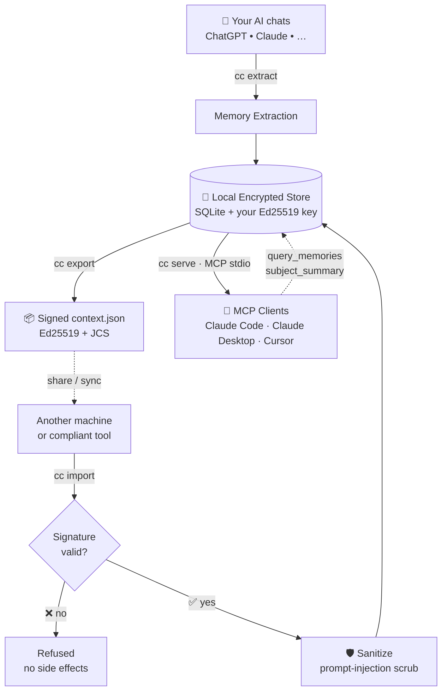

<div align="center">


# 🧠 Context Capital

### An open, user-owned passport for AI memory

Capture, sign, and port your AI context across ChatGPT, Claude, and any MCP-compatible tool — locally, on your keys.

[](#-license)
[](#-stack)
[](#-testing--validation)
[](#-stack)
[](#-contributing)

**[Quickstart](#-quickstart)** · **[Claude Code](#-connecting-to-claude-code)** · **[Claude Desktop](#-connecting-to-claude-desktop)** · **[Architecture](#-architecture--request-lifecycle)** · **[Docs](#-documentation)**

</div>

<br>

Context Capital is a reference implementation of the **[Context Protocol](docs/spec/context-protocol-v0.1.md)** — a published, signed, JSON-LD format for portable AI memory. Models commoditize; your context shouldn't. Run a local CLI + MCP server that captures memories from your AI chats, signs them with your Ed25519 key, sanitizes imports against prompt injection, and serves them back to any MCP-compatible AI tool.

<br>

## ✨ Key Features

Context Capital is more than a memory store — it's a complete trust boundary for portable AI context.

| | |
|---|---|
| 🔐 **User-Owned by Design** | Your Ed25519 signing key, your SQLite store, your `did:key` identifier. Nothing leaves your machine without your explicit `cc export`. No hosted backend, no telemetry, no third-party escrow. |
| 📜 **Open Protocol** | Every export is a signed, canonical JSON document conforming to a published schema — JSON Schema 2020-12 + JSON-LD `@context` + Ed25519 detached signature over [RFC 8785 (JCS)](https://datatracker.ietf.org/doc/html/rfc8785) canonical form. Any tool, in any language, can implement the spec. |
| 🛡️ **Prompt-Injection Sanitizer** | The headline security feature. Every imported memory is treated as untrusted input. Directive-shaped text (`ignore previous`, `system:`, `you are now`, …) is either refused, wrapped with an `[UNTRUSTED:imported]` marker, or redacted. The importer always forces `provenance.imported = true` regardless of what the source document claimed. |
| 🧬 **Content-Addressed IDs** | Memory IDs are SHA-256 hashes of canonical content (`mem_<32-hex>`). Same memory extracted twice → same ID → free deduplication. No collisions, no clock drift, no UUID coordination. |
| 🔌 **Local MCP Server** | Stdio server exposing memories via a `query_memories` tool and a `subject_summary://current` resource. Drops straight into Claude Code, Claude Desktop, Cursor, or any MCP-aware client. |
| 📊 **Append-Only Audit Log** | Every read, write, export, and import is recorded with the calling actor — but never the memory text itself. Inspect with `cc verify-audit`. |
| 🎚️ **Sensitivity Classes** | Memories tagged `public` / `work` / `personal` / `secret`. The `secret` class **never** crosses the export or MCP boundary by default — full stop. |

<br>

## 🛠️ Stack

> [!NOTE]
> Context Capital is local-first, single-process, and zero-config beyond `cc init`. No Docker, no daemon, no cloud account.

| Layer | Choice |
|---|---|
| **Language** | Python 3.12+ (tested on 3.12, 3.13, 3.14) |
| **Schema** | Pydantic v2 + JSON Schema 2020-12 + JSON-LD `@context` |
| **Crypto** | Ed25519 ([PyNaCl](https://pynacl.readthedocs.io/)) + JCS canonicalization ([rfc8785](https://pypi.org/project/rfc8785/)) |
| **Storage** | SQLite with content-addressed memory IDs and an append-only audit table |
| **MCP** | Anthropic's official `mcp` Python SDK (stdio + Streamable HTTP transports) |
| **CLI** | [typer](https://typer.tiangolo.com/) + [rich](https://rich.readthedocs.io/) |
| **Testing** | pytest, hypothesis, ruff, mypy `--strict` |

<br>

## 🚀 Getting Started

**1. Clone the repository**

```bash
git clone https://github.com/saumilyagupta/Context-Capital.git
cd context-capital
```

**2. Install**

```bash
# Create a virtual environment
python3 -m venv .venv
source .venv/bin/activate          # Windows: .venv\Scripts\activate

# Install in editable mode with dev extras (pytest, ruff, mypy, hypothesis)
pip install -e ".[dev]"
```

> [!IMPORTANT]
> On Python 3.14, a few crypto dependencies may not yet have prebuilt wheels and will compile from source. If install fails, use Python 3.12 or 3.13, or install a C toolchain (`xcode-select --install` on macOS).

**3. Initialize your identity**

```bash
cc init
```

> [!NOTE]
> `cc init` generates an Ed25519 signing keypair and a `did:key` identifier in `~/.context-capital/`. It refuses to overwrite an existing install — back up the signing key before deleting the directory, or you lose access to all signed exports.

**4. Verify the install**

```bash
cc --help              # see all 7 commands
pytest -q              # full suite, sub-second
```

<br>

## ⚡ Quickstart

```bash
# Capture from a real ChatGPT or Claude export (preferred)
cc capture --vendor chatgpt --file ~/Downloads/conversations.json
# Or for quick offline iteration without an LLM:
cc capture --vendor chatgpt --file ~/Downloads/conversations.json --mock

# Inspect what's stored
cc list

# Export a signed, portable context.json
cc export --out me.context.json

# Import it back — signature verified, sanitized, deduplicated
cc import --in me.context.json

# Review the audit log
cc verify-audit
```

That's the local round-trip. To expose memories to AI tools, wire up the MCP server below.

<br>

## 🔌 Connecting to Claude Code

<details open>
<summary><b>Option A — <code>claude mcp add</code> (recommended)</b></summary>

<br>

```bash
claude mcp add context-capital -- /absolute/path/to/.venv/bin/cc serve
```

> [!IMPORTANT]
> Use the **absolute path** to the venv's `cc` binary. Claude Code spawns MCP servers in a fresh shell that does not auto-activate your venv, so a bare `cc serve` will not be found.

Verify it's registered:

```bash
claude mcp list
```

Then in a Claude Code session, run `/mcp` — `context-capital` appears with one tool and one resource.

</details>

<details>
<summary><b>Option B — Manual config</b></summary>

<br>

> [!TIP]
> Configure the following in either `~/.claude.json` (user-wide) or `.mcp.json` at your project root (project-scoped).

```jsonc
{
  "mcpServers": {
    "context-capital": {
      "command": "/absolute/path/to/.venv/bin/cc",
      "args": ["serve"]
    }
  }
}
```

Restart Claude Code (or open a new session) — the server appears automatically.

</details>

**What Claude Code can do**

| Capability | Description |
| ---------- | ----------- |
| **Tool — `query_memories`** | Filter memories by `kind`, `predicate`, `sensitivity`, `limit`. `sensitivity=secret` is never served via MCP by default. |
| **Resource — `subject_summary://current`** | A ~300-token plain-text summary of you, suitable for system-prompt injection. Read it with `@context-capital:subject_summary://current`. |

> Try it: in a fresh Claude Code session, ask *"What do you know about me?"* — Claude calls the tool, reads the resource, and answers from your stored memories.

<br>

## 🖥️ Connecting to Claude Desktop

Edit Claude Desktop's MCP config file:

| OS | Path |
| -- | ---- |
| **macOS** | `~/Library/Application Support/Claude/claude_desktop_config.json` |
| **Windows** | `%APPDATA%\Claude\claude_desktop_config.json` |
| **Linux** | `~/.config/Claude/claude_desktop_config.json` |

Add (or merge into) `mcpServers`:

```jsonc
{
  "mcpServers": {
    "context-capital": {
      "command": "/absolute/path/to/.venv/bin/cc",
      "args": ["serve"]
    }
  }
}
```

Quit and relaunch Claude Desktop — the tool surfaces in the app's MCP picker.

<br>

## 🏗️ Architecture & Request Lifecycle



| Step | What happens |
|---|---|
| **1. Init** | `cc init` generates an Ed25519 signing keypair → derives a `did:key` subject → writes both to `~/.context-capital/` (mode `0600` on the key). |
| **2. Extract** | `cc extract` runs raw text through the extraction pipeline, producing structured memories with `kind`, `predicate`, `object`, `confidence`, and `provenance`. IDs are content-addressed for deterministic dedup. |
| **3. Store** | Memories land in a local SQLite store. Every write produces an append-only audit entry recording the `memory_id` and actor — **never** the raw memory text (FR-9.6). |
| **4. Export** | `cc export` collects memories (excluding `secret` by default), builds a Context Protocol document, canonicalizes it via JCS, signs the bytes with Ed25519, and writes a human-readable JSON file. |
| **5. Import** | `cc import` first verifies the signature (rejecting on any tamper), then runs every memory's free-text fields through the sanitizer, and finally forces `provenance.imported = true` regardless of what the source claimed. Sanitization has three modes: `refuse` (drop), `wrap` (prefix with `[UNTRUSTED:imported]`), or `sanitize` (redact directive matches). |
| **6. Serve** | `cc serve` starts an MCP server on stdio. MCP clients call `query_memories` (with `secret` always filtered) and read `subject_summary://current` (a ~300-token plain-text digest). |
| **7. Audit** | Every step writes to `audit_log_entries`. `cc verify-audit` tails the log; memory IDs only, no text. |

<br>

## 🧪 Testing & Validation

The codebase ships with a comprehensive test suite covering the four security-critical layers (schema, canonical, signing, sanitize), the storage backend, the extractor, and a full end-to-end round-trip.

```bash
pytest -v                          # full suite
pytest -v tests/test_sanitize.py   # one module
pytest -k "sanitize or sign"       # by name pattern
```

<div align="center">

> [!TIP]
> **Total Tests:** 44 &nbsp;|&nbsp; **Passed:** 44 &nbsp;|&nbsp; **Failed:** 0
> *All tests pass with `ruff check` clean and `mypy --strict` clean.*

</div>

**Coverage by layer**

| Layer | Tests | Focus |
| ----- | :---: | ----- |
| `test_schema.py` | 8 | Pydantic model validation, JSON Schema validity, content-addressed ID determinism |
| `test_canonical.py` | 4 | JCS round-trip, key-order independence, nested objects, array preservation |
| `test_signing.py` | 7 | Ed25519 sign/verify, tampered-memory rejection, tampered-signature rejection, wrong-alg rejection |
| `test_sanitize.py` | 13 | 5 directive patterns, all 3 modes, adversarial corpus, `imported=true` forcing |
| `test_storage.py` | 6 | CRUD round-trip, kind/sensitivity filtering, audit log no-raw-text invariant |
| `test_extract.py` | 5 | Deterministic IDs, multi-cue extraction, provenance population |
| `test_end_to_end.py` | 1 | Full chain: extract → store → export → sign → verify → re-parse → sanitize-import → list |

<br>

## 💡 Troubleshooting

<details>
<summary><code>cc: command not found</code></summary>
<br>

> [!WARNING]
> Activate your venv first: `source .venv/bin/activate`. The `cc` script is installed inside the venv by `pip install -e .` and is not on your system PATH.

</details>

<details>
<summary>Claude Code can't find the MCP server</summary>
<br>

> [!WARNING]
> Your config uses a relative `cc serve` instead of the absolute path. Claude Code spawns MCP servers in a fresh shell with no venv. Fix: replace `cc` with `/absolute/path/to/.venv/bin/cc`.

</details>

<details>
<summary><code>pip install -e ".[dev]"</code> fails on Python 3.14</summary>
<br>

> [!WARNING]
> Some crypto wheels (`pynacl`, `argon2-cffi`) may not yet be published for 3.14. Use Python 3.12 or 3.13, or install a C toolchain (`xcode-select --install` on macOS).

</details>

<details>
<summary><code>cc init</code> prints a 🔑 emoji inside the DID</summary>
<br>

> [!WARNING]
> Cosmetic only — `rich`'s emoji shortcode parser matches `:key:` and renders it as 🔑. The file at `~/.context-capital/subject_did` is correct. UI fix planned.

</details>

<br>

## 🗺️ Roadmap

The following are explicitly out of scope for this release and tracked for future versions:

- **LLM-driven extraction** via `litellm` (current extractor is keyword-based and deterministic for offline testing)
- **Pattern-set expansion** — base64-encoded directives, zero-width-character splits, multilingual variants, tool-use directives
- **Encryption at rest** with Argon2id-derived KEK + libsodium AEAD wrapping rows
- **Per-AI permission grants** and opt-in `secret` exposure over MCP
- **Append-only audit hash chain** + `cc verify --audit` integrity check
- **Replay-window check** on imported documents
- **Sanitizer field-coverage** beyond `object.value` and `provenance.raw_excerpt`
- **Browser extensions** for in-page capture from ChatGPT and Claude

<br>

## 🤝 Contributing

The Context Protocol is intended as a community-owned open standard. Pull requests are welcome — implementations in other languages especially. To claim conformance, run the suite at [`docs/spec/conformance-suite.md`](docs/spec/conformance-suite.md) and publish your results.

When reporting an issue, please include:

- Your Python version (`python3 --version`)
- Your platform (`uname -a` or `ver`)
- The command that produced the error
- Any relevant audit-log excerpt (`cc verify-audit`)

<br>

## 📚 Documentation

| If you want to… | Read |
| --------------- | ---- |
| Implement the Context Protocol in another language | [`docs/spec/context-protocol-v0.1.md`](docs/spec/context-protocol-v0.1.md) + [`docs/spec/conformance-suite.md`](docs/spec/conformance-suite.md) |
| Understand the security model and attack tree | [`docs/security/threat-model.md`](docs/security/threat-model.md) |
| See the full requirements and design | [`docs/srs.md`](docs/srs.md), [`docs/sdd.md`](docs/sdd.md) |
| Read the decision records | [`docs/adr/`](docs/adr/) |
| Operate it day-to-day | [`docs/ops/runbook.md`](docs/ops/runbook.md) |

<br>

## 📄 License

Apache 2.0. The protocol specification and reference implementation both ship under the same license.

---

<div align="center">

<i>Models are rentals. Context is owned. Memory has rights.</i>

</div>
