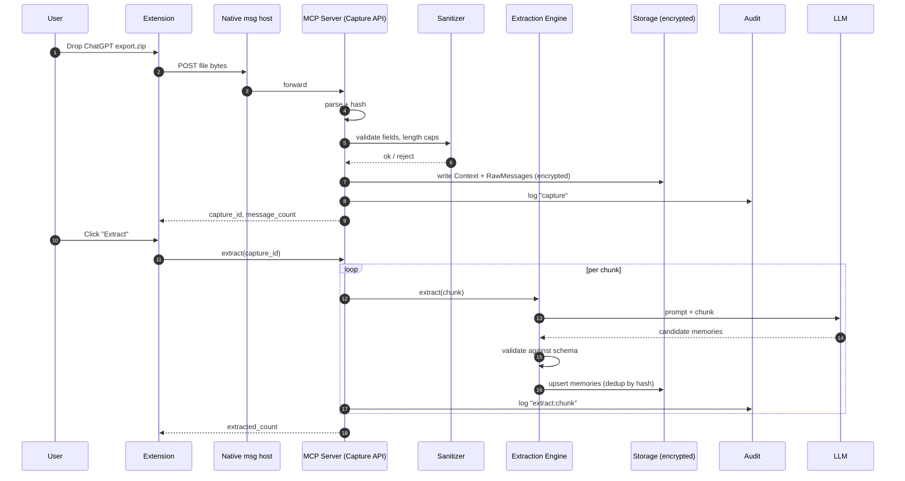
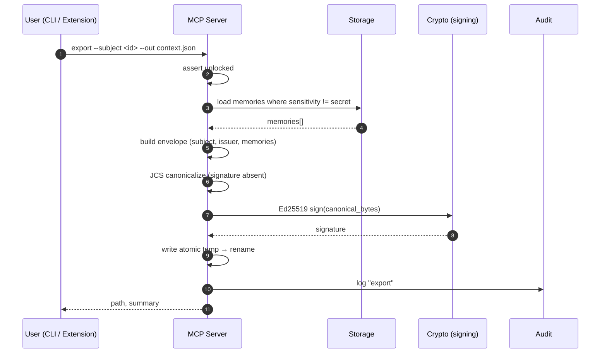
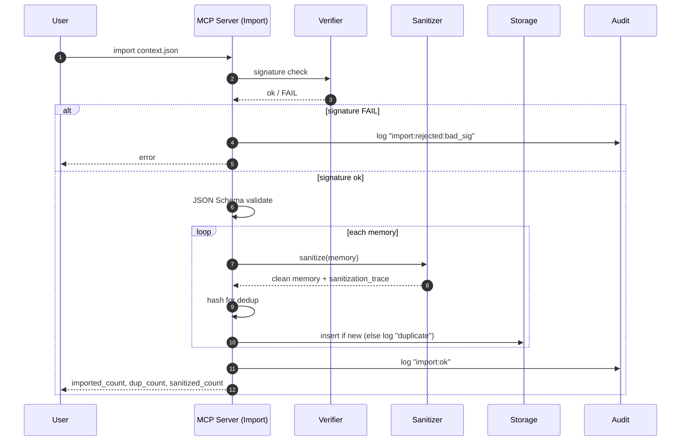
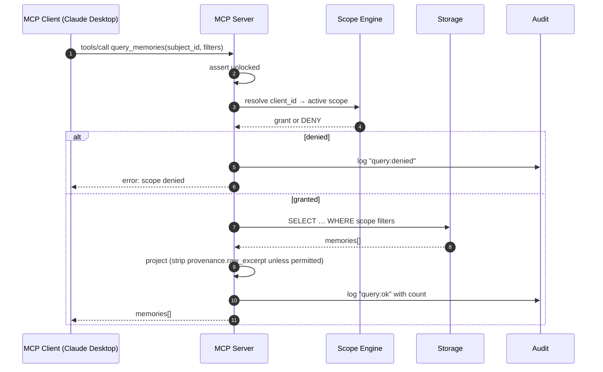

# Software Design Document — Context Capital Phase 1

| | |
|---|---|
| **Document** | SDD — Context Capital Phase 1 |
| **Version** | Draft v0.1 |
| **Date** | 2026-06-18 |
| **Status** | Draft |
| **Companion docs** | [`srs.md`](./srs.md), [`spec/context-protocol-v0.1.md`](./spec/context-protocol-v0.1.md), [`data-model.md`](./data-model.md), [`api/README.md`](./api/README.md), [`security/threat-model.md`](./security/threat-model.md) |

This document specifies the **design** for the Phase-1 reference client described in the SRS. It describes architecture, per-component responsibilities, sequence flows, failure modes, deployment topology, and observability.

---

## 1. Architecture Overview

### 1.1 Top-down view

```
┌────────────────────────────────────────────────────────────────────┐
│  AI VENDORS                                                        │
│  ChatGPT (export.zip)     Claude (export.json)                     │
└──────────────────────────┬─────────────────────────────────────────┘
                           │  user-initiated file drop
                           ▼
┌────────────────────────────────────────────────────────────────────┐
│  CAPTURE LAYER (TS, in browser extension + CLI fallback)           │
│  • Drop zone & file picker  • Hash + provenance tagging            │
│  • Parser: chatgpt + claude • Streaming for large files            │
└──────────────────────────┬─────────────────────────────────────────┘
                           │  raw_messages + context envelope
                           ▼
┌────────────────────────────────────────────────────────────────────┐
│  SANITIZATION LAYER (Python, server side)                          │
│  • Pattern-based directive scrubber                                │
│  • Vendor provenance tagging                                       │
│  • Rejects: schema violations, missing sensitivity                 │
└──────────────────────────┬─────────────────────────────────────────┘
                           │  clean raw_messages
                           ▼
┌────────────────────────────────────────────────────────────────────┐
│  EXTRACTION ENGINE                                                 │
│  • litellm-driven model dispatcher                                 │
│  • Prompt templates per kind (preference/fact/decision/…)          │
│  • Confidence scoring; schema-validate before commit               │
└──────────────────────────┬─────────────────────────────────────────┘
                           │  candidate memories
                           ▼
┌────────────────────────────────────────────────────────────────────┐
│  STORAGE LAYER                                                     │
│  Postgres 16 + pgvector + JSONB  (primary)                         │
│  SQLite 3.42 + sqlite-vec        (single-user fallback)            │
│  ┌──────────────────────────────────────────────────────────────┐ │
│  │  CRYPTO LAYER — age + libsodium                              │ │
│  │  Argon2id-derived key │ OS keystore wrap                     │ │
│  └──────────────────────────────────────────────────────────────┘ │
└──────────────┬──────────────────────────────────────┬─────────────┘
               │  memory queries                       │  audit writes
               ▼                                       ▼
┌────────────────────────────────────────┐  ┌────────────────────────┐
│  MCP SERVER (Python, mcp SDK)          │  │  AUDIT SUBSYSTEM       │
│  Tools: query_memories, get_memory,    │  │  Append-only,          │
│         record_observation             │  │  hash-chained,         │
│  Resources: subject_summary://current  │  │  encrypted at rest     │
│  Transports: stdio + Streamable HTTP   │  └────────────────────────┘
└──────────────┬─────────────────────────┘
               │
               ▼
┌────────────────────────────────────────────────────────────────────┐
│  MCP CLIENTS (Claude Desktop, future MCP-compatible tools)         │
└────────────────────────────────────────────────────────────────────┘
```

### 1.2 Logical layering
The product separates strictly into:

| Layer | Process | Trust | Owns secrets? |
|---|---|---|---|
| **UI** | Chrome extension (TS/React) | Untrusted side | No (passes through to server) |
| **CLI** | Python `typer` (`cc` command) | Trusted (runs as user) | Loads key into memory |
| **MCP server** | Python `mcp` SDK process | Trusted | Holds in-memory key when unlocked |
| **Storage** | Postgres or SQLite (local) | Trusted | Stores AEAD-encrypted blobs |
| **Crypto** | `libsodium` / `age` in-process | Trusted | Key in memory only when unlocked |

The browser extension talks to the local MCP server via native messaging (preferred for Phase 1) or loopback HTTP. **It never sees the raw decryption key.**

### 1.3 What's *not* in the picture
- No hosted backend.
- No queue (extraction runs in-process; for batch volumes the SDD permits a future job runner — out of Phase 1).
- No telemetry pipeline. Logs go to local files only.

## 2. Component Design

### 2.1 Chrome extension (`cc-ext`)

**Tech:** TypeScript 5.x · React 19 · Vite · Manifest V3.

**Surfaces:**
- **Background service worker** — long-running task: receive native-messaging messages from MCP server, handle file uploads, surface notifications.
- **Options page** — full React UI for capture, scope management, audit viewing, lock/unlock.
- **Popup** — quick status (locked/unlocked, last capture, current scope).
- **Content script** — *not used in Phase 1* (no DOM scraping per C-1).

**Permissions in `manifest.json`:**
```json
{
  "permissions": ["nativeMessaging", "storage"],
  "optional_permissions": ["clipboardWrite"]
}
```
No `host_permissions`. No content-script injection.

**Native-messaging host:** the MCP server registers a native-messaging manifest at install time so the extension can talk to it without loopback HTTP.

**State:** Extension is **stateless about memories**. Anything beyond UI preference goes to the server. Local extension storage holds only: theme, last-used model, and the native-messaging connection identity.

### 2.2 Ingestion pipeline

**Tech:** Python 3.12 with `pydantic` for record validation.

**Modules:**
- `ingest.chatgpt` — parses ChatGPT's `conversations.json`. Returns `(Context, list[RawMessage])`.
- `ingest.claude` — parses Claude's `.json` export. Same return type.
- `ingest.common` — shared types, hashing utilities (SHA-256 of the export file → `provenance.export_file_hash`), streaming JSON reader for large files.

**Streaming:** Large exports (>200 MB) are read incrementally via `ijson` so peak RSS stays bounded. The pipeline emits records as it parses; downstream stages can begin work before parsing completes.

**Validation strategy:**
- Reject early on missing required vendor fields with a structured error pointing at JSON path.
- Tolerant of vendor schema drift: unknown fields are preserved in a `raw` JSONB column for forensic re-extraction.

### 2.3 Sanitization layer

**Tech:** Python · `re` + a small Rust extension via `pyo3` for hot-path regex (optional, P1).

**Pipeline (in order):**
1. **Encoding normalization** — decode all string fields to NFC Unicode; reject mixed-direction surrogates.
2. **Length caps** — `raw_excerpt` capped at 4096 chars (matches spec §6); over-cap entries truncated with a `…[truncated]` marker.
3. **Directive detection** — pattern set:
   - `(?i)\bignore\s+(all\s+)?previous\b`
   - `(?i)\bsystem\s*:`
   - `(?i)\byou\s+are\s+now\b`
   - `(?i)\boverride\s+your\b`
   - `(?i)\bact\s+as\s+(if|a)\b`
   - …extensible via a config file.
4. **Action on hit** — three modes (per spec §11.1.1): refuse, wrap, or sanitize-and-tag. Default is **wrap**: the string is preserved but prefixed with `[UNTRUSTED:imported] ` so downstream models see it labeled.
5. **Provenance tagging** — every imported memory gets `provenance.imported = true`, `provenance.import_source = <issuer.tool>`, and a `sanitization_trace` field with the pattern IDs that fired.
6. **Default-deny on missing sensitivity** — refuses the document if any memory has missing/invalid `sensitivity`.

**Adversarial test hooks:** the sanitization module exposes `evaluate(payload: str) -> SanitizationResult` so the test harness (and threat-model corpus) can drive it directly.

### 2.4 Memory extraction engine

**Tech:** Python · `litellm` for model dispatch · `instructor` (or equivalent) for structured-output schema enforcement.

**Pipeline per context:**
1. **Chunk** — split raw conversation into windows of ~6,000 tokens with 500-token overlap.
2. **Prefix** — assemble cached prompt prefix: system prompt + extraction instructions + output schema (cacheable across all calls).
3. **Extract** — call LLM with chunk as the variable suffix. Output forced to JSON matching the v0.1 schema for a `memories[]` fragment.
4. **Validate** — JSON Schema validation against `context-protocol-v0.1.md`. Invalid entries dropped with a logged reason.
5. **Hash & deduplicate** — compute `mem_<sha256-of-canonical>` for each candidate; skip if exists.
6. **Persist** — single transaction per chunk, with audit entry.

**Determinism:** `temperature=0` + cached prefix + canonical input ordering = deterministic memory IDs (SRS FR-3.4).

**Resumability:** Chunk completion is checkpointed in `extraction_jobs` table (see data model). Restart resumes from the last completed chunk.

**Model layer:**
- Default: `anthropic/claude-sonnet-4-7` with prompt caching.
- Fallback: `openai/gpt-4-mini` for users without Anthropic.
- Local: any Ollama-served model accepted (e.g. `ollama/llama-3.3-8b`). Quality may be lower; the test plan covers this.

### 2.5 Storage layer

**Primary backend:** Postgres 16 with extensions:
- `pgcrypto` — server-side AEAD for envelope encryption.
- `pgvector ≥ 0.7` — vector index for semantic recall.

**Fallback backend:** SQLite 3.42 with `sqlite-vec` for single-user, no-dependencies installations.

**Access layer:** `sqlmodel` (Python) over `asyncpg` / `aiosqlite`. The schema is identical modulo type names (`JSONB` vs `JSON`, `bytea` vs `blob`); the access layer parameterizes those.

**Encryption boundary:** rows store **ciphertext** in columns like `memory.value_enc`, `provenance.raw_excerpt_enc`. Plaintext never touches disk except inside Postgres' temp files during query; for the threat model, see `security/threat-model.md` §5.

**Migrations:** `alembic` for Postgres; bespoke versioned SQL for SQLite (smaller schema). Both share a `schema_version` table.

### 2.6 Crypto layer

**Primitives:**
- **AEAD:** XChaCha20-Poly1305 via `libsodium` (`pynacl`).
- **KDF:** Argon2id (`argon2-cffi`), parameters: `time_cost=3`, `memory_cost=64 MiB`, `parallelism=4`.
- **Signature:** Ed25519 via `pynacl`.
- **File encryption:** `age` for the rare case of file-level encrypted backups.

**Key hierarchy:**
```
[User passphrase]            [Hardware-key]
        |                          |
        v Argon2id                 v wrap
[Key-Encryption-Key (KEK)] ────────┤
                                   v
                  [Data-Encryption-Key (DEK)]
                                   |
                                   v
                  AEAD-encrypts all row payloads
```

**Storage of KEK wrap material:**
- macOS: Keychain (`security` framework).
- Windows: DPAPI per-user.
- Linux: Secret Service via `secretstorage`.
- Fallback: a file `kek.wrap` with explicit permission warnings.

**Lock/unlock:** Unlocking loads the DEK into a `mlock`-ed memory region (best-effort; Python limits some primitives). Locking zeroizes and discards the DEK. The MCP server refuses all requests when DEK is absent.

**Signature keys:** A separate Ed25519 keypair for context-document signing. Stored alongside the DEK wrap. The public key is the subject's `did:key`.

### 2.7 MCP server

**Tech:** Python 3.12 · Anthropic `mcp` Python SDK · stdio and Streamable HTTP transports.

**Process model:** One server per host user, started on demand by:
- The CLI (`cc serve`).
- Claude Desktop launch hook.
- The browser extension on first capture.

**Tool surface (spec §FR-7.3):**
- `query_memories(subject_id, filters)` → list of memories matching kind/predicate/sensitivity/text filters.
- `get_memory(memory_id)` → single memory.
- `record_observation(observation_text)` → user-confirmed memory creation (P1; appears as a UI prompt before persistence).

**Resource surface:**
- `subject_summary://current` → a 300-token plaintext summary of the current subject, suitable for system-prompt injection.

**Scope enforcement:** every call resolves the calling client identity (from MCP session metadata) against the active scope grant. Memories outside the grant are filtered before serialization. Audit log records the filtered count for forensic visibility.

**Server-side guardrails:**
- Refuses if locked (returns `LOCKED` error).
- Per-call timeout default 5s.
- Per-client rate limit: 60 calls/min by default; configurable.

### 2.8 Permissions and audit

**Permission model:**
- `scope_grants` table (see data model): named grants with `client_id`, `allowed_sensitivity`, `allowed_kinds`, `allowed_predicates`, `expires_at`.
- Default: deny-all.
- A grant signed by the user (HMAC under DEK or Ed25519 under signing key) so a foreign process can't forge a row directly.

**Audit subsystem:**
- Append-only logical log (Postgres: `INSERT`-only via a role lacking `UPDATE`/`DELETE`; SQLite: trigger that rejects non-`INSERT`).
- Each entry includes the prior entry's hash → tamper-evident chain.
- Daily integrity check (`cc verify --audit`) recomputes the hash chain and reports breaks.

## 3. Sequence Diagrams

### 3.1 Capture → extract → store



### 3.2 Export to context.json



### 3.3 Import with sanitization



### 3.4 MCP client query



## 4. Data Flow

| Stage | Trust direction | Action | What stays |
|---|---|---|---|
| Capture | Vendor → Local | Parse, hash, tag | Raw message bytes (encrypted at rest) |
| Sanitize | (Import only) | Detect directives, wrap | Sanitization trace |
| Extract | Local → LLM API → Local | Send chunks, receive memories | Memories + provenance |
| Store | Local | AEAD-encrypt → DB | Ciphertext rows |
| Export | Local → File | Decrypt → canonicalize → sign | Signed JSON |
| Import | File → Local | Verify → sanitize → store | Sanitized memories |
| Serve | Local → MCP client | Scope filter → project → respond | Audit entry |

**Data never crosses these boundaries:**
- `sensitivity=secret` memories never leave the device (FR-5.2, FR-7.5, FR-8.6).
- Audit entries do not contain raw text (FR-9.6).
- Telemetry is off by default (NFR-PRV-2).

## 5. Deployment Topology

### 5.1 Phase 1 — local single-user (canonical)

```
┌────────────────────────────────────────────┐
│  User's machine                            │
│  ┌──────────────┐    ┌──────────────────┐ │
│  │ Browser ext  │◄──►│ MCP server proc  │ │
│  └──────────────┘    │   (Python)       │ │
│                      └────────┬─────────┘ │
│  ┌──────────────┐             │           │
│  │ Claude       │             ▼           │
│  │ Desktop      │◄────► (stdio)           │
│  └──────────────┘    ┌──────────────────┐ │
│                      │ Local SQLite or  │ │
│                      │ Postgres + pgv   │ │
│                      └──────────────────┘ │
│                      ┌──────────────────┐ │
│                      │ OS Keystore      │ │
│                      └──────────────────┘ │
└────────────────────────────────────────────┘
```

### 5.2 Phase 1.5 — developer & integration testing
- Docker Compose bundle: Postgres + pgvector + the MCP server, with bind-mounts for the encryption keys (development only).
- Used for CI and for team-internal manual testing. Not for end users.

### 5.3 Out of scope
Hosted multi-tenant, on-prem enterprise, mobile — all phase 2+ per SRS §8.

## 6. Error and Failure Modes

| Component | Failure | Behavior | Recovery |
|---|---|---|---|
| Capture parser | Malformed export | Reject with JSON-path pointer; no partial write | User re-exports |
| Sanitizer | Pattern fires | Wrap by default; refuse if `--strict` | Configurable mode |
| Extraction | LLM timeout | Retry with backoff (×3); mark chunk failed | `cc extract --resume` |
| Extraction | Invalid JSON output | Drop entry; log with model name | Tighten extraction prompt |
| Storage | Postgres unreachable | Fail fast on startup; if mid-run, MCP server enters degraded mode and returns `STORAGE_DOWN` | Operator action |
| Storage | SQLite locked | Block with backoff up to 5s, then `STORAGE_BUSY` | Internal queueing |
| Crypto | Locked | Return `LOCKED` on every request | User unlocks |
| Crypto | Wrong passphrase | After 5 failed attempts in 60s, sleep 30s | Time-based throttle |
| Signing | Key missing | Refuse export with `KEY_MISSING` | Run `cc init-keys` |
| Import | Bad signature | Abort import; no side effects | Re-export at source |
| Import | Schema fail | Abort; log path | Re-export at source |
| Import | Sanitization in `refuse` mode | Drop entry; continue | Switch to `wrap` mode |
| MCP server | Client outside scope | Return `SCOPE_DENIED`; log | User grants new scope |
| Audit log | Hash chain break | `verify` flags; reads still work; writes paused until ack | Operator review |

Every error returns a structured envelope:
```json
{ "error": { "code": "LOCKED", "message": "Store is locked", "details": { ... } } }
```

## 7. Observability

### 7.1 Logs
- **Format:** structured JSON to stdout/stderr (or a log file specified at install).
- **No PII:** memory text, raw excerpts, passphrases, keys MUST NOT appear (NFR-SEC-5).
- **Levels:** TRACE/DEBUG/INFO/WARN/ERROR. Default INFO.
- **Retention:** rotated by `logrotate`-style local config; not shipped anywhere.

### 7.2 Metrics
- Prometheus-format `/metrics` endpoint on the MCP server (loopback only).
- Counters: captures, extractions, exports, imports, mcp_calls, sanitizer_hits, scope_denials.
- Histograms: extraction latency, query latency, export size.
- No metrics about memory content.

### 7.3 Tracing
- `tracing` library wired but disabled by default (NFR-PRV-2). Opt-in via `--otel-endpoint`.

### 7.4 Health
- `/health` — liveness.
- `/ready` — readiness; checks DB reachable + crypto initialized (does not require unlocked).

## 8. Build, Package, Install (overview)

- **Server:** `pip install context-capital` (private index initially); Phase 1 also ships a single-file PyInstaller binary for non-developer users.
- **Extension:** Chrome Web Store unlisted listing for invite-only Phase 1 testers; sideload via `chrome://extensions` during dev.
- **CLI:** `cc` entry point installed by the server package.

Distribution details live in [`ops/runbook.md`](./ops/runbook.md).

## 9. Cross-Doc References

This document is the *spine* of the build pack. Other docs implement subsets:

- [`srs.md`](./srs.md) — requirements that this design satisfies.
- [`spec/context-protocol-v0.1.md`](./spec/context-protocol-v0.1.md) — the data format §5 implements.
- [`data-model.md`](./data-model.md) — concrete tables for §2.5.
- [`api/README.md`](./api/README.md) — the surface §2.7 exposes.
- [`security/threat-model.md`](./security/threat-model.md) — adversarial analysis of §2.3 and §2.6.
- [`testing/test-plan.md`](./testing/test-plan.md) — how §6 failure modes are validated.
- [`ops/runbook.md`](./ops/runbook.md) — operational concerns of §5.
- [`adr/*.md`](./adr/) — the load-bearing decisions in §2 and §1.2.

## Document control

- **Approved when:** SRS §F-1..F-9 each map to one §2 component; every §6 failure has a test in `test-plan.md`; deployment diagram validated against runbook.
- **Change policy:** any cross-component design change updates this SDD AND the affected ADR.
