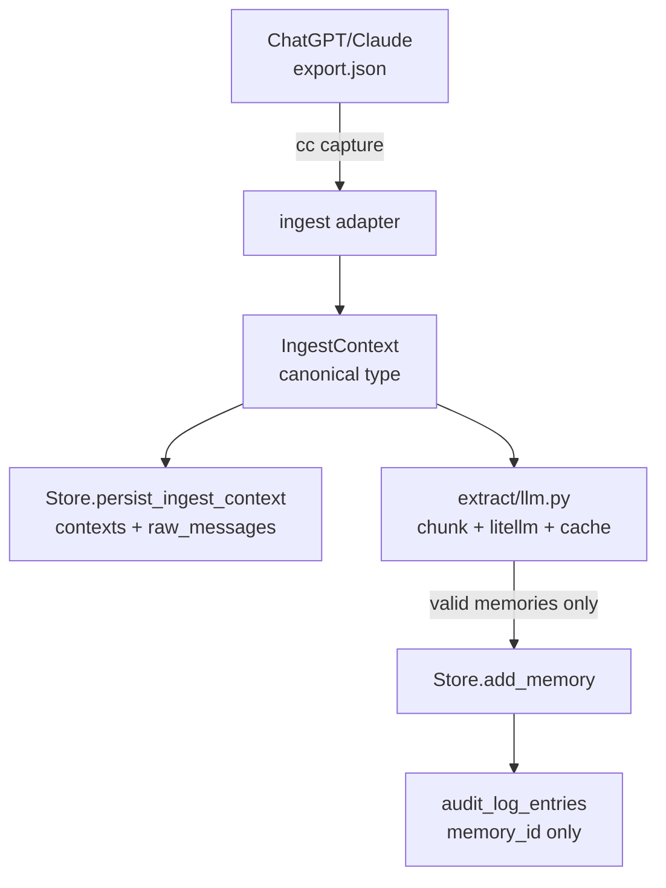

# Design Spec — Real Capture Pipeline (F-1 + F-2 + F-3)

**Date:** 2026-06-22
**Status:** Approved by user (2026-06-22); plan-writing next
**Parent docs:** [`../../srs.md`](../../srs.md), [`../../sdd.md`](../../sdd.md), [`../../adr/001-capture-mode.md`](../../adr/001-capture-mode.md), [`../../adr/005-extraction-model.md`](../../adr/005-extraction-model.md)
**Supersedes parts of:** the mock-only extraction from `2026-06-18-context-capital-build-pack-design.md`
**Closes SRS gates:** G-1 (round-trip with real exports), and partially Q-3 / Q-4

---

## 0. Purpose

Replace the mock keyword extractor with the real capture pipeline that SRS Phase-1 mandates:

- **F-1** Capture from ChatGPT export (`conversations.json`)
- **F-2** Capture from Claude export (data-export JSON)
- **F-3** Memory extraction via a real LLM (`litellm`-fronted, default Anthropic Claude, prompt caching on)

After this work ships, `cc capture --vendor chatgpt --file conv.json` runs end-to-end against real export data, the resulting memories signed-export → import round-trip cleanly, and the Phase-1 ship gate **G-1** is met.

## 1. Goals and Non-Goals

### Goals
- A working `cc capture` CLI command that ingests official vendor exports and persists structured memories.
- Two vendor adapters (ChatGPT, Claude) that emit a canonical `IngestContext` type the extractor consumes.
- A real `litellm`-fronted extractor with prompt caching, structured-output forcing, resumability, and the existing mock as an explicit `--mock` fallback for offline iteration.
- An anonymizer tool (`tools/anonymize_export.py`) so the user can supply a real export and have it stripped of PII for the test corpus.
- ≥80% test coverage of the new code; pytest suite stays green; ruff + mypy --strict clean.

### Non-Goals (deferred)
- Chrome MV3 extension (separate repo per ADR-001).
- Encryption at rest, lock/unlock (Bucket A — separate spec).
- Per-AI scope grants (Bucket C — separate spec).
- Postgres + pgvector storage (Bucket E).
- Additional vendor adapters beyond ChatGPT and Claude.
- Browser-side ingestion (out of scope for Phase 1).

## 2. Scope (Locked)

Concretely, this spec covers the following file additions and modifications. Nothing existing moves.

```
src/context_capital/
├── ingest/                          # NEW package
│   ├── __init__.py
│   ├── types.py
│   ├── chatgpt.py
│   ├── claude.py
│   └── streaming.py
├── extract/
│   └── llm.py                       # NEW (mock.py preserved)
└── cli.py                           # MODIFIED — new `cc capture`; `cc extract` gets --model/--mock flags

tools/
├── __init__.py                      # NEW
└── anonymize_export.py              # NEW

tests/
├── test_ingest_chatgpt.py           # NEW
├── test_ingest_claude.py            # NEW
├── test_ingest_streaming.py         # NEW
├── test_extract_llm.py              # NEW
├── test_tools_anonymize.py          # NEW
└── fixtures/
    ├── captures/
    │   ├── chatgpt-synthetic.json   # NEW — small synthesized fixture for CI
    │   ├── claude-synthetic.json    # NEW
    │   ├── chatgpt-anonymized.json  # USER-PROVIDED (anonymized)
    │   └── claude-anonymized.json   # USER-PROVIDED
    └── llm-responses/
        └── extract-golden.json      # NEW — recorded canonical extractor output
```

## 3. Architecture

```
                ┌────────────────────────────────────────┐
                │ ChatGPT export.json    Claude export.json
                └────────────────┬───────────────────────┘
                                 │ (CLI: cc capture)
                                 ▼
                ┌───────────────────────────────────────┐
                │  ingest/ (vendor adapters)           │
                │  chatgpt.py  ⇲                       │
                │              ⇨  IngestContext        │
                │  claude.py   ⇱   (canonical type)    │
                └────────────────┬──────────────────────┘
                                 │
                                 ▼
                ┌───────────────────────────────────────┐
                │  extract/llm.py                       │
                │  litellm + Claude (default) + cache   │
                │  Schema-forced structured output     │
                │  Resumable per-chunk                 │
                └────────────────┬──────────────────────┘
                                 │  list[Memory dict]
                                 ▼
                ┌───────────────────────────────────────┐
                │  storage/sqlite.py (existing)        │
                │  + audit_log_entries                 │
                └───────────────────────────────────────┘
```

The boundary between vendor-specific code and vendor-neutral code is exactly the `IngestContext` type produced by adapters in §4.1. Nothing past that boundary knows about ChatGPT or Claude.

## 4. Component Design

### 4.1 `ingest/types.py` — canonical conversation record

```python
from datetime import datetime
from enum import StrEnum
from pydantic import BaseModel, ConfigDict, Field

class IngestRole(StrEnum):
    USER = "user"
    ASSISTANT = "assistant"
    TOOL = "tool"
    SYSTEM = "system"
    OTHER = "other"

class IngestMessage(BaseModel):
    model_config = ConfigDict(extra="forbid")
    seq: int = Field(ge=0)
    role: IngestRole
    content: str
    created_at: datetime | None = None
    vendor_message_id: str | None = None

class IngestContext(BaseModel):
    model_config = ConfigDict(extra="forbid")
    vendor: str                       # "chatgpt" | "claude"
    vendor_conversation_id: str
    title: str | None = None
    captured_at: datetime
    source_file_hash: str             # SHA-256 of the source export file
    messages: list[IngestMessage]
```

This is the only shape the extractor sees. Vendor adapters produce one `IngestContext` per conversation in the export.

### 4.2 `ingest/chatgpt.py` — ChatGPT export parser

**Input shape (ChatGPT `conversations.json`, abridged):**

```jsonc
[
  {
    "id": "conv_abc",
    "title": "...",
    "create_time": 1717372800.0,
    "mapping": {
      "node-id-1": {
        "id": "node-id-1",
        "parent": "node-id-0",
        "children": ["node-id-2"],
        "message": {
          "id": "msg-id",
          "author": { "role": "user", "name": null },
          "create_time": 1717372900.0,
          "content": { "content_type": "text", "parts": ["..."] }
        }
      },
      "...": "..."
    }
  }
]
```

**Algorithm:**
1. Open the file; for files >50 MB use the streaming reader from `ingest/streaming.py`.
2. SHA-256 the file bytes for `source_file_hash`.
3. For each conversation: start at the root node (the one whose `parent` is null or unknown), walk children depth-first taking only nodes whose `message.author.role` is in {`user`, `assistant`, `tool`, `system`}, in node-order.
4. Concatenate `content.parts` (strings only — non-string parts get a placeholder `[non-text part]` so structure is preserved without panic).
5. Filter out empty-content turns (some assistant nodes are placeholders).
6. Build `IngestMessage`s with `seq` = 0-indexed position in walk; `created_at` = Unix epoch → UTC ISO.
7. Emit one `IngestContext`.

**Public API:** `def parse_chatgpt_export(path: Path) -> Iterator[IngestContext]`.

### 4.3 `ingest/claude.py` — Claude export parser

**Input shape (Claude data export, abridged):**

```jsonc
[
  {
    "uuid": "conv_xyz",
    "name": "...",
    "created_at": "2025-01-01T00:00:00Z",
    "updated_at": "...",
    "chat_messages": [
      {
        "uuid": "msg-uuid",
        "text": "...",
        "sender": "human",
        "created_at": "...",
        "content": [
          { "type": "text", "text": "..." },
          { "type": "tool_use", "name": "..." }
        ]
      }
    ]
  }
]
```

**Algorithm:**
1. Open; stream if >50 MB.
2. SHA-256.
3. For each conversation: enumerate `chat_messages` in array order.
4. Map `sender` → `IngestRole` (`human` → `user`).
5. For each message, prefer `content[]` array if present (concatenate `text` parts, append `[tool_use: <name>]` markers for non-text parts); fall back to top-level `text` field.
6. Emit one `IngestContext`.

**Public API:** `def parse_claude_export(path: Path) -> Iterator[IngestContext]`.

### 4.4 `ingest/streaming.py`

Thin `ijson`-based reader for the top-level array. Yields one conversation dict at a time so peak RSS stays bounded on large exports.

**Public API:** `def stream_top_level_array(path: Path) -> Iterator[dict[str, Any]]`.

**Threshold:** `if file_size > CC_STREAM_THRESHOLD_BYTES (default 50 * 1024 * 1024)`. Override via env var.

### 4.5 `extract/llm.py` — real LLM extractor

```python
def extract_memories(
    *,
    subject_id: str,
    context: IngestContext,
    model: str = "anthropic/claude-sonnet-4-5",
    prompt_cache: bool = True,
    chunk_tokens: int = 6000,
    chunk_overlap_tokens: int = 500,
) -> list[dict[str, Any]]:
    """Extract memories from a conversation. Resumable per chunk."""
```

**Pipeline:**

1. **Chunk** the conversation's concatenated messages into ~6,000-token windows with 500-token overlap. Token counting via `litellm.token_counter`.
2. **Assemble prompt** — a cacheable prefix (system prompt + JSON Schema for a single Memory + extraction instructions) + a per-chunk variable suffix.
3. **Call LLM** via `litellm.completion` with `temperature=0`, `response_format={"type": "json_object"}`, and the prompt-cache flag enabled when supported.
4. **Validate** every returned memory against `CONTEXT_PROTOCOL_V0_1_SCHEMA["properties"]["memories"]["items"]`. Drop invalids with a logged reason; never raise on a single bad memory.
5. **Compute IDs** via existing `compute_memory_id`. Drop duplicates within the same call.
6. **Persist nothing** here — return the memory list. The CLI persists via the existing `Store`.

**Determinism:** `temperature=0` + content-addressed IDs = re-running the same chunk produces identical memory IDs.

**Resumability hook:** function takes an optional `from_chunk: int = 0` parameter. The CLI integration uses this to resume after a crash. Per-chunk checkpoint state lives in the `extraction_jobs` table (already in the DDL, currently unused — wire it now).

**Default model:** `anthropic/claude-sonnet-4-5` (the latest Sonnet as of 2026-06; bump in ADR-005 when newer ships).

**Mock fallback:** existing `extract.mock.extract_mock_memories` is preserved. CLI exposes `--mock` flag.

### 4.6 `tools/anonymize_export.py` — PII stripper

```python
def anonymize(*, vendor: str, in_path: Path, out_path: Path, seed: int | None = None) -> AnonymizeReport:
    """Read a real export, strip PII deterministically, write the anonymized version."""
```

**Strips:**

| What | How |
|---|---|
| Email addresses | Regex `\b[\w.+-]+@[\w.-]+\.\w+\b` → `<email-N>` where N is a stable per-input counter |
| URLs | `https?://[host]/[path]` → `https://example.invalid/<path-hash>` |
| Phone numbers | Common E.164 + US patterns → `<phone-N>` |
| Common first names | Built-in list of top 500 names (case-insensitive token match) → `<name-N>` |
| Project/company hints | Heuristic: capitalized words ≥ 4 chars not in a stop-list → `<project-N>` *(optional, behind `--aggressive` flag)* |
| API keys | Patterns for OpenAI (`sk-...`), Anthropic (`sk-ant-...`), AWS (`AKIA...`), GitHub (`ghp_...`) → `<api-key>` (red flag — log a warning) |

**Output:**
- Anonymized JSON next to the original with the substitution map redacted (never written to disk; only the report holds it).
- A side-car `.seed.txt` file containing the seed used so the run is reproducible.

**CLI:** `python -m tools.anonymize_export --vendor chatgpt --in real.json --out anon.json [--aggressive] [--seed 42]`.

### 4.7 `cc capture` CLI command

```
cc capture --vendor <chatgpt|claude> --file <path> [--mock] [--model <id>] [--resume]
```

Pseudocode:

```python
def capture(vendor: str, file: Path, mock: bool, model: str | None, resume: bool):
    subject_id = _load_subject_id()
    parser = {"chatgpt": parse_chatgpt_export, "claude": parse_claude_export}[vendor]
    extractor = extract_mock_memories if mock else partial(extract_memories, model=model or "anthropic/claude-sonnet-4-5")
    with Store(_store_path()) as store:
        store.ensure_subject(subject_id)
        for ic in parser(file):
            store.persist_ingest_context(ic, source_vendor=vendor)
            mems = extractor(subject_id=subject_id, context=ic) if not mock else extractor(subject_id=subject_id, raw_text=" ".join(m.content for m in ic.messages))
            for m in mems:
                store.add_memory(m, actor="cli:capture")
```

**Store extension needed:** `Store.persist_ingest_context(ic, source_vendor)` — adds the conversation envelope to `contexts` and the messages to a new `raw_messages` table (already in the DDL of `data-model/schema.sql` but not in `storage/sqlite.py`). Small surgical addition.

### 4.8 `cc extract` CLI changes (backward-compatible)

```
cc extract --text "..." [--mock] [--model <id>]
```

`--text` keeps the existing behavior (one-shot extraction from a string). With `--mock` (the current default, kept to avoid breaking existing tests), uses `extract_mock_memories`. Without `--mock`, calls the real `extract_memories` over a single-conversation `IngestContext` built from the text. Default model flag matches `cc capture`.

## 5. Data Flow



The `raw_messages` persistence lets us re-extract later with a different model or prompt without re-asking the user for the export file.

## 6. Failure Modes

| Component | Failure | Behavior | Recovery |
|---|---|---|---|
| ingest parser | Malformed JSON | Reject with the JSON path of the first invalid record; no partial write | User re-exports |
| ingest parser | Unknown vendor field | Tolerate; preserve in `raw` JSONB on the context row; log key name once per file | Update parser if new field is important |
| ingest parser | Empty conversation | Skip with a `WARN` log; not an error | none |
| streaming | File >4 GB hard-cap | Reject with `EXPORT_TOO_LARGE` | None — split the export |
| extractor | LLM timeout | Retry ×3 with backoff (1s/4s/16s); mark chunk failed; `extraction_jobs.status='failed'` | `cc capture --resume` |
| extractor | Invalid JSON from model | Drop chunk output; log model + chunk seq | Tighten prompt or change model |
| extractor | Schema-validation failure on memory | Drop that memory; log reason; continue chunk | none |
| extractor | API auth failure | Fail loudly with provider error + suggest `--mock` | Fix API key |
| store | Duplicate `(subject_id, export_file_hash)` | Treat as no-op (idempotent) — same file ingested twice should not double-write | none |
| anonymizer | API-key pattern detected in input | Log a CRITICAL warning identifying the pattern; still anonymize the value | Investigate the export |

## 7. Tests

| File | What it tests | Tier |
|---|---|---|
| `test_ingest_chatgpt.py` | Synthetic + real-anonymized ChatGPT fixtures parse correctly; mapping-tree walk preserves order; `tool` / `system` roles handled; file-hash deterministic | Unit + integration |
| `test_ingest_claude.py` | Same for Claude `chat_messages` array; tool_use markers preserved | Unit + integration |
| `test_ingest_streaming.py` | >50 MB synthetic file ingests with bounded peak RSS (assert `tracemalloc` peak < 200 MB) | Integration |
| `test_extract_llm.py` | Recorded golden-response fixture; assert chunking math, deterministic IDs, schema-validation drops, mock fallback path | Unit (no live API) |
| `test_tools_anonymize.py` | Email/URL/name patterns stripped; deterministic given a fixed seed; same input → same output | Unit |

**Real-data tests** are marked `@pytest.mark.real_data` and run only when `tests/fixtures/captures/*-anonymized.json` exists. CI skips them.

**LLM live test** runs nightly only, via a `@pytest.mark.live_llm` marker and the `CONTEXT_CAPITAL_RUN_LIVE_LLM=1` env var. Default `pytest` does not call any API.

## 8. Definition of Done

This work is complete when **all** of:

- [ ] `cc capture --vendor chatgpt --file <real-export>` runs end-to-end, persists memories, writes audit log.
- [ ] `cc capture --vendor claude --file <real-export>` does the same.
- [ ] Synthesized + (when user-provided) anonymized fixtures both parse without errors.
- [ ] `cc capture --mock` still works for offline iteration (deterministic mock extractor).
- [ ] Round-trip on a real export ≥ 200 conversations: capture → export → import-into-clean-instance → verify all memories present with `provenance.imported=true`. (SRS G-1)
- [ ] All new modules pass ruff + mypy --strict.
- [ ] `pytest -q` is green (excluding `real_data` and `live_llm` markers).
- [ ] Updated `docs/srs.md` checklist: G-1 marked done.
- [ ] README quickstart updated to use `cc capture` instead of `cc extract --text "..."`.

## 9. Out of scope (do not let scope creep in)

| Item | Why deferred |
|---|---|
| Encryption at rest (F-4) | Bucket A — separate spec/plan |
| Scope grants (F-8) | Bucket C |
| Postgres + pgvector | Bucket E |
| Chrome MV3 extension | Separate repo, ADR-001 |
| Conformance test driver (G-4) | Separate small spec |
| Additional vendor adapters (Gemini, Copilot) | Phase 2 |
| Real-time MCP "record_observation" tool | Phase 1.5 polish |

## 10. Open Questions

These are explicitly deferred until they actually bite, OR until the user makes a call:

1. **Anonymizer aggressiveness.** Built-in name list is small (top 500). For exports with niche names this misses. Solution path: ship as-is, expand the list later, optional `--names-file` flag in v0.2.
2. **Token-counter accuracy across providers.** `litellm.token_counter` is approximate for non-OpenAI models. Chunk sizes may be 5–10% off for Claude; acceptable.
3. **Multi-modal exports.** Claude exports can include images/files. Phase 1 ignores non-text parts with a placeholder marker. Not a blocker.
4. **Tool-call payloads.** Both vendors include tool-call structured data. Phase 1 concatenates the tool call's `name` and string-coercible args; complex tool payloads are not modeled separately. Revisit in Phase 2.

## 11. References

- `../../srs.md` — F-1, F-2, F-3, NFR-PRF-1/2/5
- `../../sdd.md` §2.2 (ingestion), §2.4 (extraction)
- `../../adr/001-capture-mode.md` — locks "official export only"
- `../../adr/005-extraction-model.md` — locks litellm + default Claude + prompt cache
- `../../security/threat-model.md` §2.2 (ingestion threats), §4.2 (LLM API supply chain)
- `../../testing/test-plan.md` §2.2, §2.5

## 12. Estimated Cost

| Phase | Cost |
|---|---|
| Spec self-review | small |
| Plan writing (writing-plans skill) | $5–10 |
| Implementation execution (subagent-driven, 5 modules + 5 test files) | $40–80 |
| Per-task reviews | $10–20 |
| Buffer for fixes | $10–20 |
| **Total** | **~$65–130** |
